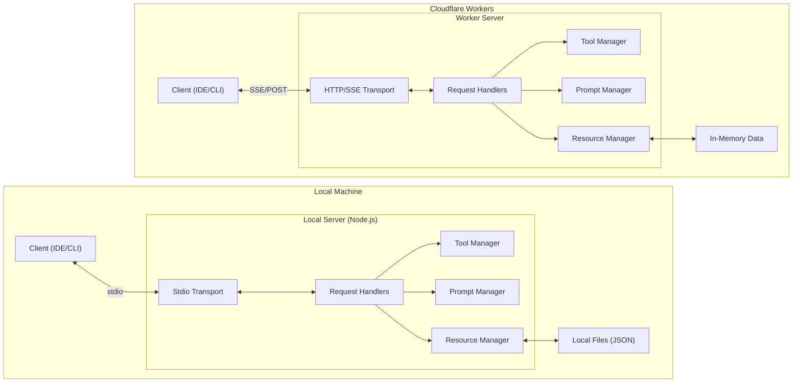

# Simplest MCP Demo

A minimal, complete demonstration of the Model Context Protocol (MCP) featuring both server and client implementations with prompts, tools, and resources.

## Overview

This project showcases the core capabilities of MCP:
- **Prompts**: Pre-defined templates for common tasks
- **Tools**: Callable functions that perform operations
- **Resources**: Accessible data sources

## Architecture



## Features

| Category | Name | Description | Inputs |
|----------|------|-------------|--------|
| **Prompt** | `creative-writing` | Generates a creative writing prompt based on a topic and style. | `topic`* (string), `style` (string, optional) |
| **Prompt** | `code-review` | Creates a structured code review request. | `language`* (string), `code`* (string) |
| **Prompt** | `explain-concept` | Explains a technical concept at a specified expertise level. | `concept`* (string), `level` (string, optional) |
| **Tool** | `calculate` | Performs basic arithmetic operations (add, subtract, multiply, divide). | `operation`* ("add"\|"subtract"\|"multiply"\|"divide"), `a`* (number), `b`* (number) |
| **Tool** | `generate-uuid` | Generates a random UUID v4. | - |
| **Tool** | `get-weather` | Returns simulated weather data for a given city. | `city`* (string) |
| **Tool** | `reverse-string` | Reverses the provided text string. | `text`* (string) |
| **Resource** | `quotes://all` | Retrieves a collection of programming quotes. | - |
| **Resource** | `facts://all` | Retrieves a collection of technology facts. | - |


## Project Structure

```
simplest-mcp/
├── local/               # Local MCP server implementation
│   ├── server.js        # stdio transport server
│   ├── client.js        # Local client demo
│   └── test.sh          # Test script
├── remote/              # Cloudflare Workers implementation
│   ├── src/
│   │   └── worker.js    # HTTP/SSE transport server
│   ├── proxy.js         # SSE proxy for remote connection
│   ├── wrangler.toml    # Workers configuration
│   └── client.js        # Remote client demo
├── resources/           # Shared sample data
│   ├── quotes.json
│   └── facts.json
├── package.json         # Project configuration
└── README.md            # Documentation
```

## Quick Start

### Installation

```bash
git clone https://github.com/hissain/simplest-mcp.git
cd simplest-mcp
npm install
```

### Local Development (stdio)

```bash
# Run local demo
npm run client:local

# Or manually
node local/client.js
```

### Remote Hosting (Cloudflare Workers)

**Deploy:**
```bash
npm install -g wrangler
wrangler login
npm run deploy
```

**Test Remote:**
```bash
# Local dev server
npm run start:remote

# Remote client test
npm run client:remote -- http://localhost:8787
```

## Client Configuration

Works with **Google Antigravity IDE**, **Claude Desktop**, and **VS Code (Cline)**.

### 1. Local Server (stdio)
Add this to your IDE's MCP configuration file (e.g., `claude_desktop_config.json`, `mcp.json`, or Antigravity config):

```json
{
  "mcpServers": {
    "simplest-mcp": {
      "command": "node",
      "args": ["/absolute/path/to/simplest-mcp/local/server.js"]
    }
  }
}
```

### 2. Remote Server (SSE)
Use this configuration to connect to the deployed Cloudflare Worker:

**JSON Config:**
```json
{
  "mcpServers": {
    "simplest-mcp-remote": {
      "command": "node",
      "args": [
        "/absolute/path/to/simplest-mcp/remote/proxy.js",
        "https://your-worker.workers.dev/sse"
      ]
    }
  }
}
```

**VS Code (Cline) UI:**
- **Command**: `MCP: Add Server`
- **Name**: `simplest-mcp-remote`
- **Type**: `sse`
- **URL**: `https://your-worker.workers.dev/sse`

## Client Demo

### Local Client
Demonstrates stdio transport:
```bash
npm run client:local
```

### Remote Client
Demonstrates HTTP/SSE transport:
```bash
npm run client:remote -- https://your-worker.workers.dev/sse
```

## Client SDK Usage

### Node.js (TypeScript/JavaScript)
Using `@modelcontextprotocol/sdk`:

```javascript
import { Client } from '@modelcontextprotocol/sdk/client/index.js';
import { StdioClientTransport } from '@modelcontextprotocol/sdk/client/stdio.js';

// Local Connection
const transport = new StdioClientTransport({
  command: 'node',
  args: ['local/server.js'],
});

const client = new Client({ name: 'my-client', version: '1.0.0' }, { capabilities: {} });
await client.connect(transport);
```

### Python
Using `mcp` package:

```python
from mcp import Client, StdioServerParameters
from mcp.client.stdio import stdio_client

server_params = StdioServerParameters(
    command="node",
    args=["local/server.js"],
)

async with stdio_client(server_params) as (read, write):
    async with Client(read, write) as session:
        # Initialize
        await session.initialize()
        
        # List tools
        tools = await session.list_tools()
        print(tools)
```


## Testing

Run the automated test suite:

```bash
./test.sh
```

The test script will:
1. Check for Node.js installation
2. Install dependencies if needed
3. Run the client demo
4. Verify all features work correctly

## Development

### Adding New Prompts

Edit `server.js` and add to the `PROMPTS` object:

```javascript
const PROMPTS = {
  'my-prompt': {
    name: 'my-prompt',
    description: 'Description of my prompt',
    arguments: [
      {
        name: 'param1',
        description: 'Parameter description',
        required: true,
      },
    ],
  },
};
```

### Adding New Tools

Add to the tools list in `ListToolsRequestSchema` handler and implement in `CallToolRequestSchema` handler.

### Adding New Resources

Add resource files to the `resources/` directory and register them in the `ListResourcesRequestSchema` and `ReadResourceRequestSchema` handlers.

## License

This project is licensed under the MIT License - see the [LICENSE](LICENSE) file for details.

## Author

**Md. Sazzad Hissain Khan**

## Contributing

Contributions, issues, and feature requests are welcome!

## Show Your Support

Give a star if this project helped you understand MCP!

## Resources

- [Model Context Protocol Documentation](https://modelcontextprotocol.io)
- [MCP SDK on npm](https://www.npmjs.com/package/@modelcontextprotocol/sdk)
- [MCP Specification](https://spec.modelcontextprotocol.io)

## Related Projects

- [MCP Servers](https://github.com/modelcontextprotocol/servers) - Official MCP server implementations
- [MCP TypeScript SDK](https://github.com/modelcontextprotocol/typescript-sdk) - TypeScript SDK for MCP

---

Made with care by Md. Sazzad Hissain Khan
